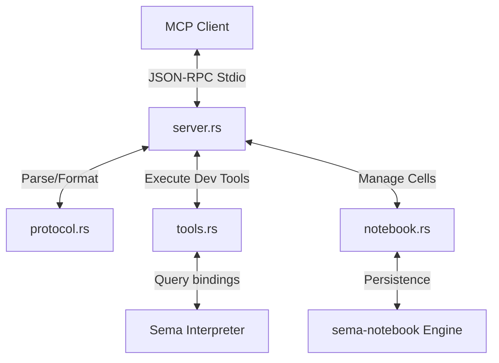

# Design Plan: Model Context Protocol (MCP) Server for Sema

This design plan outlines the revival, extension, and implementation details of the Sema Model Context Protocol (MCP)
server. It builds upon the work in PR #24 and PR #31, expanding the feature set to include default development tools,
path resolution rules, tool visibility filtering, and stateful notebook support.

---

## 1. Overview & Deployment Modes

The MCP server allows Sema to act as a tool provider for LLM clients (such as Claude Desktop, Cursor, or Claude Code).
The server communicates over standard input/output (stdio) using JSON-RPC 2.0.

It supports three execution patterns:

1. **Default Mode** (`sema mcp`): Starts the MCP server with a set of default developer tools.
2. **Filepath Mode** (`sema mcp <files...>`): Starts the MCP server exposing the default tools *plus* any user-defined
   tools created using Sema's `deftool` special form in the specified `.sema` or `.semac` files.
3. **Standalone Binary Mode** (`./my-tool --mcp`): Executables compiled via `sema build` will run their embedded script
   to define tools, then transition to starting the MCP server over stdio.

---

## 2. Default MCP Tools

When started, the MCP server will expose a core set of developer tools. These allow the LLM to inspect, compile, format,
evaluate, and build Sema code in the host environment.

### Path Resolution

To ensure reliable operation under diverse editor clients (which may execute the MCP server in different working
directories):

- All file paths in tool arguments are resolved relative to the **current working directory (CWD)** of the MCP server
  process.
- Clients can pass either absolute paths or relative paths. The server will canonicalize them before execution.

### Tool Definitions & JSON Schemas

#### 1. `run_file`

Runs a `.sema` or `.semac` file and returns its standard output, standard error, and final return value.

- **Schema**:
  ```json
  {
    "name": "run_file",
    "description": "Run a Sema source (.sema) or compiled bytecode (.semac) file.",
    "inputSchema": {
      "type": "object",
      "properties": {
        "file_path": {
          "type": "string",
          "description": "Path to the Sema file (relative to CWD or absolute)."
        },
        "arguments": {
          "type": "array",
          "items": { "type": "string" },
          "description": "Optional positional arguments to pass to the script."
        },
        "sandbox": {
          "type": "string",
          "enum": ["strict", "no-shell", "no-network", "allow-all"],
          "description": "Optional sandbox override mode."
        }
      },
      "required": ["file_path"]
    }
  }
  ```

#### 2. `compile`

Compiles a Sema source file (`.sema`) into optimized bytecode (`.semac`).

- **Schema**:
  ```json
  {
    "name": "compile",
    "description": "Compile a .sema file to .semac bytecode.",
    "inputSchema": {
      "type": "object",
      "properties": {
        "source_path": {
          "type": "string",
          "description": "Path to the source .sema file."
        },
        "output_path": {
          "type": "string",
          "description": "Destination path for the compiled .semac bytecode file (optional)."
        }
      },
      "required": ["source_path"]
    }
  }
  ```

#### 5. `eval`

Evaluates a raw Sema expression string in the global environment and returns the result, capturing any output sent to
stdout/stderr.

- **Schema**:
  ```json
  {
    "name": "eval",
    "description": "Evaluate a single Sema expression string and return the result and captured stdout/stderr.",
    "inputSchema": {
      "type": "object",
      "properties": {
        "code": {
          "type": "string",
          "description": "The Sema expression to evaluate (e.g., '(+ 1 2)')."
        },
        "sandbox": {
          "type": "string",
          "enum": ["strict", "no-shell", "no-network", "allow-all"],
          "description": "Optional sandbox override mode."
        }
      },
      "required": ["code"]
    }
  }
  ```

#### 4. `docs`

Retrieves docstring and parameter details for a built-in function, special form, or standard library module/symbol.

- **Schema**:
  ```json
  {
    "name": "docs",
    "description": "Get documentation and signatures for a Sema symbol or standard library function.",
    "inputSchema": {
      "type": "object",
      "properties": {
        "symbol": {
          "type": "string",
          "description": "The symbol or function name (e.g., 'string/split', 'llm/prompt')."
        }
      },
      "required": ["symbol"]
    }
  }
  ```

#### 5. `fmt`

Formats a Sema file in-place or returns formatted code from a given string.

- **Schema**:
  ```json
  {
    "name": "fmt",
    "description": "Format Sema code string or a .sema file in-place.",
    "inputSchema": {
      "type": "object",
      "properties": {
        "file_path": {
          "type": "string",
          "description": "Path to format a .sema file in-place (optional)."
        },
        "code": {
          "type": "string",
          "description": "Raw Sema code string to format and return (optional)."
        }
      }
    }
  }
  ```

#### 6. `disasm`

Disassembles a source `.sema` or bytecode `.semac` file and returns the human-readable VM bytecode instructions.

- **Schema**:
  ```json
  {
    "name": "disasm",
    "description": "Disassemble a source .sema or bytecode .semac file into VM bytecode instructions.",
    "inputSchema": {
      "type": "object",
      "properties": {
        "file_path": {
          "type": "string",
          "description": "Path to the .sema or .semac file."
        }
      },
      "required": ["file_path"]
    }
  }
  ```

#### 7. `build`

Compiles a Sema file and packages it into a standalone executable binary.

- **Schema**:
  ```json
  {
    "name": "build",
    "description": "Build a standalone executable from a .sema file.",
    "inputSchema": {
      "type": "object",
      "properties": {
        "source_path": {
          "type": "string",
          "description": "Path to the source .sema file."
        },
        "output_path": {
          "type": "string",
          "description": "Destination path for the compiled standalone binary executable."
        }
      },
      "required": ["source_path", "output_path"]
    }
  }
  ```

#### 8. `info`

Returns environment information about the running Sema interpreter and MCP server context.

- **Schema**:
  ```json
  {
    "name": "info",
    "description": "Get version and environment info about the running Sema MCP server.",
    "inputSchema": {
      "type": "object",
      "properties": {}
    }
  }
  ```

---

## 3. Tool Filtering & Visibility

When loading files in filepath mode, developers need control over which defined tools are exposed to the LLM client. We
will implement three filtering mechanisms:

### A. Automatic Name Filtering (Hidden Prefix)

- Tool definitions starting with an underscore (e.g., `_my-helper`) are treated as private helper tools.
- They will be evaluated and accessible in the environment, but **skipped** during MCP discovery.

### B. Declarative Metadata Tags

- We will extend the parameter map of the `deftool` form to support optional metadata configuration keys.
- If a tool specifies `:mcp/expose #f` or `:private #t` in its parameters metadata, it will be excluded from the MCP
  tool list:
  ```sema
  (deftool my-secret-tool
    "An internal tool not shown to MCP clients"
    {:mcp/expose #f
     :param-a {:type :string}}
    (lambda (param-a) ...))
  ```

### C. CLI Explicit Filters

- Command-line flags `--include` and `--exclude` will allow explicit overrides on startup:
  ```bash
  sema mcp tools.sema --exclude delete-db,secret-tool
  sema mcp tools.sema --include public-tool-a,public-tool-b
  ```

---

## 4. Notebook MCP Tools

To allow the LLM client to interact directly with Sema's notebook format (`.sema-nb`), the MCP server will expose a set
of notebook management and evaluation tools.

### State Persistence & Caching

Because cell evaluations are stateful (e.g., variables defined in Cell 1 are needed when evaluating Cell 2), the MCP
server will maintain an in-memory cache of notebook `Engine` instances:

- When a tool interacts with a notebook file, the server checks if an `Engine` is already cached for that canonical file
  path.
- If not cached, the notebook is loaded from disk, a new `Engine` is instantiated, and it is cached.
- When `notebook/eval_cell` or `notebook/eval_all` is called, the cached `Engine` evaluates the code, updates the cell
  outputs, saves the updated notebook JSON to disk, and returns the result.
- This ensures that interactive state persists across successive tool calls for the same notebook.

### Notebook Tool Definitions

#### 1. `notebook/new`

Creates a new empty `.sema-nb` notebook file.

- **Schema**:
  ```json
  {
    "name": "notebook/new",
    "description": "Create a new empty Sema notebook (.sema-nb) file.",
    "inputSchema": {
      "type": "object",
      "properties": {
        "path": {
          "type": "string",
          "description": "Destination path for the new notebook file (e.g. 'notes.sema-nb')."
        },
        "title": {
          "type": "string",
          "description": "Optional title for the notebook (defaults to 'Untitled')."
        }
      },
      "required": ["path"]
    }
  }
  ```

#### 2. `notebook/read`

Reads the structure and outputs of an existing `.sema-nb` notebook.

- **Schema**:
  ```json
  {
    "name": "notebook/read",
    "description": "Read a Sema notebook (.sema-nb) structure, cell types, source code, and outputs.",
    "inputSchema": {
      "type": "object",
      "properties": {
        "path": {
          "type": "string",
          "description": "Path to the .sema-nb notebook file."
        }
      },
      "required": ["path"]
    }
  }
  ```

#### 3. `notebook/add_cell`

Appends or inserts a new cell (code or markdown) into a notebook.

- **Schema**:
  ```json
  {
    "name": "notebook/add_cell",
    "description": "Add a new cell (code or markdown) to a notebook.",
    "inputSchema": {
      "type": "object",
      "properties": {
        "path": {
          "type": "string",
          "description": "Path to the .sema-nb notebook file."
        },
        "type": {
          "type": "string",
          "enum": ["code", "markdown"],
          "description": "The type of the cell."
        },
        "source": {
          "type": "string",
          "description": "The source code or markdown content for the cell."
        },
        "after_id": {
          "type": "string",
          "description": "Optional cell ID to insert after. If omitted, appends to the end."
        }
      },
      "required": ["path", "type", "source"]
    }
  }
  ```

#### 4. `notebook/update_cell`

Modifies the source or type of an existing cell.

- **Schema**:
  ```json
  {
    "name": "notebook/update_cell",
    "description": "Update the source code or cell type of an existing notebook cell.",
    "inputSchema": {
      "type": "object",
      "properties": {
        "path": {
          "type": "string",
          "description": "Path to the .sema-nb notebook file."
        },
        "id": {
          "type": "string",
          "description": "The unique cell ID."
        },
        "source": {
          "type": "string",
          "description": "New source content (optional)."
        },
        "type": {
          "type": "string",
          "enum": ["code", "markdown"],
          "description": "New cell type (optional)."
        }
      },
      "required": ["path", "id"]
    }
  }
  ```

#### 5. `notebook/delete_cell`

Deletes a cell from a notebook.

- **Schema**:
  ```json
  {
    "name": "notebook/delete_cell",
    "description": "Delete a cell from a notebook.",
    "inputSchema": {
      "type": "object",
      "properties": {
        "path": {
          "type": "string",
          "description": "Path to the .sema-nb notebook file."
        },
        "id": {
          "type": "string",
          "description": "The cell ID to remove."
        }
      },
      "required": ["path", "id"]
    }
  }
  ```

#### 6. `notebook/eval_cell`

Evaluates a single code cell, updating its outputs in the notebook file and returning the result.

- **Schema**:
  ```json
  {
    "name": "notebook/eval_cell",
    "description": "Evaluate a single code cell, saving outputs back to the file and returning results.",
    "inputSchema": {
      "type": "object",
      "properties": {
        "path": {
          "type": "string",
          "description": "Path to the .sema-nb notebook file."
        },
        "id": {
          "type": "string",
          "description": "The ID of the cell to evaluate."
        }
      },
      "required": ["path", "id"]
    }
  }
  ```

#### 7. `notebook/eval_all`

Evaluates all code cells in the notebook in order, saving outputs back to the file and returning results.

- **Schema**:
  ```json
  {
    "name": "notebook/eval_all",
    "description": "Evaluate all code cells in order, saving outputs back to the file and returning results.",
    "inputSchema": {
      "type": "object",
      "properties": {
        "path": {
          "type": "string",
          "description": "Path to the .sema-nb notebook file."
        }
      },
      "required": ["path"]
    }
  }
  ```

#### 8. `notebook/export`

Exports the notebook as standard Markdown or a clean Sema Lisp source script.

- **Schema**:
  ```json
  {
    "name": "notebook/export",
    "description": "Export a notebook to Markdown or a clean .sema source file.",
    "inputSchema": {
      "type": "object",
      "properties": {
        "path": {
          "type": "string",
          "description": "Path to the .sema-nb notebook file."
        },
        "format": {
          "type": "string",
          "enum": ["markdown", "source"],
          "description": "Target export format (markdown or raw source code)."
        },
        "output_path": {
          "type": "string",
          "description": "Optional destination path on disk. If omitted, returns the exported text directly."
        }
      },
      "required": ["path", "format"]
    }
  }
  ```

## 5. Architectural Integration & Idiomatic Rust Structure

To ensure we do not inherit bad patterns (like monolithic source files, redundant/skewed dependencies, or global clippy
silences), `sema-mcp` is designed around idiomatic Rust principles (
cross-referencing [mre/idiomatic-rust](https://github.com/mre/idiomatic-rust)):

### 5.1 Crate Modularity

Instead of building a single monolithic source file, the implementation is decomposed into distinct,
single-responsibility modules:

* **`src/protocol.rs`**: Pure data layer defining JSON-RPC 2.0 requests, responses, error codes, and MCP tool schemas.
  Fully decoupled from the interpreter and I/O.
* **`src/tools.rs`**: Translates between Sema data structures and MCP tools. Implements parameter schema generation (
  `sema_value_to_json_schema`) and argument mapping. Handles tool visibility filtering rules.
* **`src/notebook.rs`**: Manages stateful notebook operations, integrating with `sema-notebook::Engine` and caching
  engine instances in a thread-safe/RefCell-bound map.
* **`src/server.rs`**: Manages async I/O loop reading from stdin and writing to stdout/stderr. Implements non-blocking
  frame handling to avoid DAP-style channel deadlocks.
* **`src/lib.rs`**: Facade exposing public entry points `run_mcp_server`.



### 5.2 Workspace Dependency Hygiene

* **No Path/Version Redundancy**: Sibling crates and external crates (including `gag` and `serde_json`) are declared
  centrally in the root `Cargo.toml` under `[workspace.dependencies]`.
* **Inherited Specs**: Subcrate `Cargo.toml` files inherit version and path definitions using the `.workspace = true`
  modifier.
* **No Global Warnings Suppression**: Crate roots will not declare `#![allow(...)]` tags. All Clippy lints will be
  resolved natively.

### 5.3 Standalone Binary Execution Flow
Standalone executables are built using `sema build <file.sema>`, which compiles the source Lisp code into `__main__.semac` bytecode and packages it into an archive.
To bundle the MCP server capabilities without adding redundant overhead or compilation targets:
1.  **Shared Runtime Engine**: Both the standard `sema` CLI and the compiled binaries share the same underlying VM/Interpreter runtime logic.
2.  **Argument Interception**: In `crates/sema/src/main.rs`, the `try_run_embedded()` function runs before parsing CLI arguments. If the command line arguments contain the `--mcp` flag:
    *   The interpreter evaluates the embedded `__main__.semac` bytecode.
    *   Evaluations of forms like `(deftool ...)` dynamically register Lisp tools in the interpreter's global environment.
    *   Instead of exiting immediately after bytecode evaluation, the runner transitions to executing the `sema_mcp::run_mcp_server` stdio loop using the *same* pre-populated interpreter instance.
3.  **Result**: The compiled standalone binary behaves as an MCP server out-of-the-box when invoked with `--mcp`, exposing its embedded Lisp tools without any code alterations.

---

## 6. Testing & Verification Plan

Sema requires a rigorous test harness verifying that MCP operations behave correctly and do not crash under invalid
payloads.

### 6.1 Unit Tests

Unit tests live in-crate and target isolated logic:

* **Protocol Parsing**: Verify JSON-RPC parsing handles null/missing IDs, unknown methods, and malformed JSON payloads.
* **Schema Translation**: Verify Lisp parameters map correctly to JSON-schema types (e.g., `:string` to
  `{"type": "string"}`).
* **Filtering**: Verify tools prefixed with `_`, or containing `:mcp/expose #f` or `:private #t` are ignored by
  discovery.

Run via: `cargo test -p sema-mcp --lib`

### 6.2 Integration Tests

Integration tests live in `crates/sema-mcp/tests/mcp_test.rs`:

* **Mock Transport Handshake**: Spawn the server loop over mock asynchronous readers/writers (e.g., `tokio::io::duplex`)
  and verify the initial `initialize` and `tools/list` handshake.
* **Stateful Notebook Verification**: Run sequential calls to `notebook/add_cell`, `notebook/eval_cell`, and
  `notebook/read` on a mock file, asserting that variables defined in the first call persist in the second, and that
  updates are saved back to disk.

Run via: `cargo test -p sema-mcp --test mcp_test`

### 6.3 End-to-End (E2E) Tests

E2E tests verify the compiler integration and CLI execution path:

* **Subprocess Test Harness**: Written in `crates/sema/tests/mcp_e2e_test.rs`. Spawns `cargo run -- mcp` as a child
  process. Communicates via pipe stdio using standard JSON-RPC frames, asserting on actual standard output and verifying
  that prints go to stderr.
* **Standalone Binary Mode E2E**: Builds a temporary executable using `sema build`, runs the binary with the `--mcp`
  flag, and executes tool discovery to verify the embedded tools are exposed successfully.

Run via: `cargo test --test mcp_e2e_test`

---

## 7. Execution Checklist

Detailed in [task.md](file:///Users/helge/.gemini/antigravity/brain/cfb50e01-559e-4aa9-9456-fcebbb291d6f/task.md).

