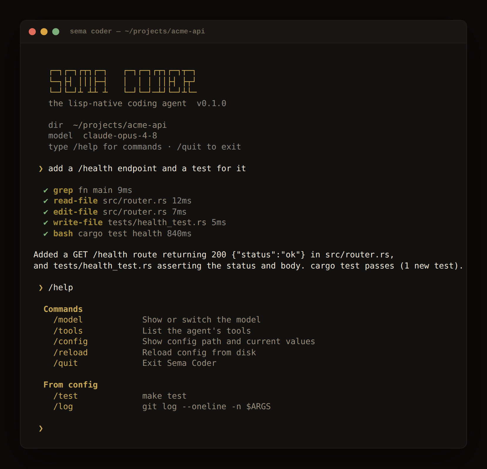

# Sema Coder

A terminal coding agent written almost entirely in [Sema](https://sema-lang.com).
It's the reference app for Sema-as-an-application-runtime: the agent loop, tools,
slash commands, theming, and config all live in Sema; only a thin layer of host
primitives (terminal screen control, path safety) is Rust.

Inspired by the open-source [pi.dev](https://pi.dev) and
[opencode](https://github.com/sst/opencode) TUIs — not a Claude Code clone.



*(Sample session; the banner, prompt, tool lines, and `/help` are the app's real
output.)*

## Run

```bash
# Interactive
sema examples/sema-coder/main.sema

# One-shot (prose to stdout, pipeable)
sema examples/sema-coder/main.sema -- -p "explain this codebase"

# Override the model
sema examples/sema-coder/main.sema -- -m claude-haiku-4-5-20251001
```

Set `ANTHROPIC_API_KEY` or `OPENAI_API_KEY` first.

## Architecture

```
examples/sema-coder/
├── main.sema       Entry point — CLI parsing, REPL loop
├── banner.sema     Wordmark + welcome (on-brand gold)
├── theme.sema      Brand palette (sema gold #c8a855)
├── config.sema     Single-file JSON config
├── commands.sema   Slash-command registry + built-ins
├── tools.sema      7 LLM-callable tools
├── agent.sema      System prompt + defagent
├── display.sema    Terminal output + tool-call rendering
└── util.sema       Path safety + string helpers
```

Reused language primitives: `defagent` / `deftool` / `agent/run` (LLM agent loop),
`file/*` and `shell` (tools), `json/*` (config), `term/*` (theming + screen control),
`path/within?` (sandboxing).

## Configuration

A single JSON file, created on first run:

| Platform | Path |
|----------|------|
| Linux    | `~/.config/sema/sema-code/config.json` |
| macOS    | `~/Library/Application Support/sema/sema-code/config.json` |
| Windows  | `%APPDATA%\sema\sema-code\config.json` |

```json
{
  "model": "",
  "max-turns": 50,
  "context-budget": 80000,
  "approve-bash": true,
  "commands": {
    "test": "make test",
    "branch": "git branch --show-current",
    "log": "git log --oneline -n $ARGS"
  }
}
```

## Slash commands

Built-ins: `/help`, `/model [name]`, `/clear`, `/tools`, `/cwd`, `/config`,
`/reload`, `/quit`, `/exit`.

### Adding commands — two ways

**1. Declaratively, in config (no code).** Add an entry to the `commands` map.
The key becomes `/name`; the value is a shell template run in the workspace, with
`$ARGS` replaced by whatever you type after the command. `/log 5` →
`git log --oneline -n 5`.

**2. In Sema, one call.** Anywhere after loading `commands.sema`:

```scheme
(register-command! "diff" "Show the working-tree diff"
  (lambda (state args)
    (run-user-command "git diff $ARGS" args)
    state))
```

A handler receives the live REPL `state` map and the argument string, and returns
the next state (or the symbol `quit` to exit).

## Tools

`read-file`, `write-file`, `edit-file`, `bash`, `grep`, `find-files`, `list-dir`.
All file paths are resolved through `path/within?`, which keeps reads and writes
inside the workspace root (catching both `../` and symlink escapes).
